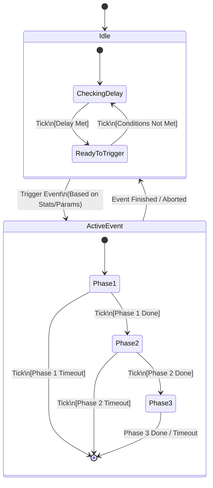

```mermaid
stateDiagram-v2
    [*] --> Idle

    state Idle {
        [*] --> CheckingDelay
        CheckingDelay --> ReadyToTrigger : Tick\n[Delay Met]
        ReadyToTrigger --> CheckingDelay : Tick\n[Conditions Not Met]
    }

    Idle --> ActiveEvent : Trigger Event\n(Based on Stats/Params)

    state ActiveEvent {
        [*] --> Phase1
        Phase1 --> Phase2 : Tick\n[Phase 1 Done]
        Phase1 --> [*] : Tick\n[Phase 1 Timeout]

        Phase2 --> Phase3 : Tick\n[Phase 2 Done]
        Phase2 --> [*] : Tick\n[Phase 2 Timeout]

        Phase3 --> [*] : Phase 3 Done / Timeout
    }

    ActiveEvent --> Idle : Event Finished / Aborted
```